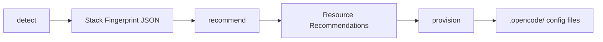

# Init Project

Unified project initialization hub with subcommand routing. Detects, scaffolds, documents, and refines an OpenCode Hubs project. Works for both first-time setup and iterative re-runs.

## When to Use

- First time setting up Hubs in a project
- Adding Hubs to an existing codebase
- Refreshing config after major changes (refactors, new deps, team growth)
- Re-running to capture new context and refine docs
- Replacing `/hubs-setup`, `/deepinit`, or `/init-project-config`

## No-Argument Behavior

When invoked without arguments (`/init-project`), list the subcommands as plain text and ask the user to choose. Do NOT call `hubMenu` or any other tool — just output the list directly. Available subcommands: setup, detect, recommend, docs, context, verify, refresh, status, map-codebase, doctor, reset, provision, tag, find-skills, find-agents, find-tools, find-rules.

## With-Argument Behavior

Directly invoke the matching subcommand. Print the reminder, then delegate to the appropriate phase or agent.

## Subcommand Routing

| Subcommand | Phases | Skill/Delegate | What It Does |
|------------|--------|----------------|--------------|
| `setup` | 0-8 | self (all phases) | Full project initialization — default runs 0-5+8, `--full` adds 6-7 |
| `detect` | 0-1 | `stack-detector` agent | Deep stack detection — languages, frameworks, build tools, testing, ORM, CSS, CI/CD, infra |
| `recommend` | 2 | `stack-recommender` skill | Map stack fingerprint to recommended global resources (skills, agents, rules, archetype) |
| `docs` | 5 | `deepinit` skill | Regenerate hierarchical AGENTS.md documentation |
| `context` | 6 | `@architect` + `@convention-extractor` + `@explore` | Deep codebase mapping, context synthesis, agent upgrade (same as `setup --full` Phase 6) |
| `verify` | 8 | `verifier` agent | Validate configuration completeness and integrity, including .gitignore privacy protections |
| `refresh` | 0-8 (merge) | self (all phases, merge mode) | Update existing config — default runs 0-5+8 merge, `--full` adds 6-7 (deep re-mapping + integration) |
| `status` | — | self (inline) | List state files and show checkpoint progress |
| `map-codebase` | — | inline | Analyze existing codebase — spawn parallel agents to map stack, architecture, conventions (subset of Phase 6) |
| `doctor` | — | inline | Run diagnostic health check — validate Hubs installation, config integrity, state consistency |
| `reset` | — | inline | Reset project state — archive .opencode/state and .opencode/context, start fresh |
| `provision` | 4 | `provision` skill | Auto-generate .opencode/ agents, skills, tools, rules from stack fingerprint + recommendations |
| `tag` | — | `tag-resources` skill | Audit and fix resource tags on global skills, agents, rules, and archetypes |
| `find-skills` | — | `find-skills` skill | Search skill registries for relevant per-repo skills |
| `find-agents` | — | `find-agents` skill | Search agent registries for relevant per-repo agents |
| `find-tools` | — | `find-tools` skill | Search registries and local template catalog for relevant TypeScript tools |
| `find-rules` | — | `find-rules` skill | Search registries and local template catalog for relevant OpenCode rules |

### Subcommand Behavior

Each subcommand follows the hub pattern:

1. **Print a terse reminder** (1-2 lines, hardcoded below — never generated dynamically)
2. **Check for prior state** in `.opencode/state/init/`
3. If prior state exists, resume automatically or start fresh based on subcommand context
4. **Execute** by delegating to the appropriate phase or agent
5. **Report results** inline — do NOT offer next steps or chain into other subcommands

### Terse Reminders

| Subcommand | Reminder on Invoke |
|------------|-------------------|
| `setup` | Full init from scratch. I'll verify global Hubs, detect your stack, scaffold config, provision agents/tools, generate docs, and validate. Use --full for deep codebase mapping and context capture. |
| `detect` | Deep stack detection via @stack-detector. I'll analyze languages, frameworks, build tools, testing, ORM, CSS, CI/CD, and more. |
| `recommend` | Recommending global resources via stack-recommender. I'll map your detected stack to relevant skills, agents, rules, and an archetype. |
| `docs` | Generating codebase documentation via deepinit. I'll create hierarchical AGENTS.md files across your directories. |
| `context` | Deep codebase mapping via parallel agents (@architect, @convention-extractor, @explore). I'll synthesize architecture and conventions into durable context and upgrade your project agents. |
| `verify` | Validating configuration via @verifier. I'll check file existence, config syntax, parent refs, and gitignore. |
| `refresh` | Updating existing config. I'll preserve your manual edits and merge new detections. Use --full for deep codebase re-mapping and context refresh. |
| `status` | Showing init state and checkpoint progress. |
| `map-codebase` | Mapping existing codebase. I'll spawn parallel agents to analyze stack, architecture, and conventions. |
| `doctor` | Running Hubs health diagnostics. I'll validate installation, config integrity, and state consistency. |
| `reset` | Resetting project state. I'll archive .opencode/state and .opencode/context to a timestamped backup and start fresh. |
| `provision` | Auto-generating .opencode/ agents/skills/tools/rules via provision skill. I'll create project-specific resources from your stack analysis. |
| `tag` | Auditing global resource tags via tag-resources. I'll scan skills, agents, rules, and archetypes for missing or incomplete tags. |
| `find-skills` | Searching skill registries for relevant skills for this project. |
| `find-agents` | Searching agent registries for relevant agents for this project. |
| `find-tools` | Searching registries and local template catalog for relevant TypeScript tools for this project. |
| `find-rules` | Searching registries and local template catalog for relevant OpenCode rules for this project. |

### Flag Parsing

Flags modify subcommand behavior and are passed through:

| Flag | Effect | Applies To |
|------|--------|------------|
| `--minimal` | Essential files only, no docs | `setup`, `refresh` |
| `--full` | Everything including context and routing | `setup`, `refresh` |
| `--force` | Skip "already exists" checks | `setup`, `refresh`, `docs` |
| `--language <lang>` | Force language, skip detection | `setup`, `detect`, `refresh` |
| `--no-detect` | Use generic defaults | `setup`, `refresh` |
| `--no-docs` | Skip Phase 4 | `setup`, `refresh` |

Default (no flags, `setup` subcommand): Phases 0-5 + 8 (full scaffold + provision + docs + verify, no deep context capture or routing integration).

With `--full`: All 9 phases (0-8) including Phase 6 (deep codebase mapping + context capture via parallel agents) and Phase 7 (routing integration validation).

Applies to both `setup` and `refresh`. In `refresh`, all phases run in merge mode — preserving manual edits, diffing existing context, and updating only changed sections.

## Detection-to-Provision Pipeline

The three new subcommands — `detect`, `recommend`, `provision` — form a sequential pipeline for intelligent project config generation:



### Step-by-step flow

1. **`/init-project detect`** — runs `@stack-detector` agent, analyzes every tech dimension (language, framework, build, test, ORM, CSS, CI/CD, infra, etc.), outputs a structured JSON fingerprint saved to `.opencode/state/init/stack-fingerprint.json`
2. **`/init-project recommend`** — runs `stack-recommender` skill, maps the fingerprint to recommended global resources (skills, agents, rules, archetype), outputs recommendations saved to `.opencode/state/init/stack-recommendations.json`
3. **`/init-project provision`** — runs `project-config-composer` skill, takes the fingerprint + recommendations, auto-generates `.opencode/opencode.jsonc`, project-specific rules, and optional agent wrappers. **All four archetype subdirectories (agents/, rules/, skills/, tools/) must be provisioned** — agents/ and rules/ are referenced in opencode.jsonc, while skills/ and tools/ must be copied/linked into the project's .opencode/ directory.

### Running the full pipeline

```bash
/init-project detect && /init-project recommend && /init-project provision
```

Or when running `setup` or `refresh`, the pipeline runs automatically:
- `setup` → detect → recommend → provision (if no existing config) or refresh (merge into existing)
- `refresh` → detect → recommend → provision (merges into existing, preserves manual edits)

### Tagging support

`/init-project tag` can run before `recommend` to ensure all global resources have complete tags:

```bash
/init-project tag && /init-project recommend && /init-project provision
```

This ensures the stack-recommender's mapping tables are complete and no resources are missed due to missing tags.

### Tool and Rule Discovery

After `provision`, if the composer reports missing tool or rule templates, run discovery:

```bash
/init-project find-tools   # Search registries for missing TypeScript tools
/init-project find-rules   # Search registries for missing OpenCode rules
```

These can also run standalone to discover resources for any project, independent of the detection pipeline.

## State Management

Init state lives in `.opencode/state/init/` (gitignored).

### State Paths

| Path | Purpose |
|------|---------|
| `.opencode/state/init/init-checkpoint.json` | Last completed phase checkpoint |
| `.opencode/state/init/init-detection.json` | Phase 1 detection results (stack fingerprint) |
| `.opencode/state/init/init-plan.json` | Phase 2 initialization plan (stack recommendations) |
| `.opencode/state/init/provision-checkpoint.json` | Phase 4 provisioned artifacts manifest |
| `.opencode/state/init/integration-report.md` | Phase 7 integration validation report (--full only) |
| `.opencode/state/init/init-report.md` | Phase 8 final verification report |
| `.opencode/state/init/` | All init state files |

### Checkpoint Format

```json
{
  "lastCompletedPhase": 3,
  "timestamp": "2024-01-15T10:30:00Z",
  "subcommand": "setup",
  "mode": "full",
  "files": [
    ".opencode/opencode.jsonc",
    ".opencode/AGENTS.md",
    ".opencode/state/"
  ]
}
```

### Resume Behavior

- **Resume**: Load latest checkpoint, continue from the next phase
- **Status**: List all state files in `.opencode/state/init/` with timestamps

### Cross-Hub Hand-Off

- `/init-project setup --full` completion can trigger `/harvest-context` offer
- `/init-project docs` output feeds into `/ideation` as project context
- `/init-project verify` results can inform `/project` operations
- `/ideation` final plans may reference `/init-project` detection results

## Architecture

| Phase | Agent/Skill | Default | --full | Purpose |
|-------|-------------|---------|--------|---------|
| 0 - Verify | self | ✓ | ✓ | Ensure `~/.config/opencode/` is healthy |
| 1 - Detection | `@stack-detector` | ✓ | ✓ | Scan project files, detect language/framework/build/test/ORM/CSS/CI |
| 2 - Planning | `stack-recommender` skill | ✓ | ✓ | Map stack fingerprint to recommended global resources |
| 3 - Configuration | `project-config-composer` skill | ✓ | ✓ | Create `.opencode/opencode.jsonc`, project rules, agent wrappers |
| 4 - Provisioning | `provision` skill | ✓ | ✓ | Generate project-specific agents, skills, tools, rules into `.opencode/` |
| 5 - Documentation | `deepinit` skill | ✓ | ✓ | Hierarchical AGENTS.md across codebase |
| 6 - Context Capture | `@architect` + `@convention-extractor` + `@explore` (parallel) | — | ✓ | Map architecture, extract conventions, map file tree → synthesize into `.opencode/context/` → upgrade Phase 4 agents with deep project knowledge |
| 7 - Routing & Integration | self (inline validation) | — | ✓ | Validate agent extends paths, skill frontmatter, tool exports, rule registration, context integrity, config syntax, .gitignore |
| 8 - Verification | `@verifier` | ✓ | ✓ | Validate completeness, references, config — final health check + integration report |

The effort in Phase 4 scales with the init mode:
- `--minimal`: Create empty directories only
- Default: Stub agents + basic commands
- `--full`: Thorough agents with full prompts + project-specific TypeScript tools + comprehensive commands + reusable skills, then Phase 6 upgrades those agents with deep project context

## Subcommand: setup

Full project initialization from scratch. Default mode runs phases 0-5 + 8 (scaffold, provision, docs, verify). With `--full`, all 9 phases run including deep context capture (Phase 6) and routing integration (Phase 7).

### Pre-Flight

Before starting any phases, determine scope:

```bash
PROJECT_ROOT="$(git rev-parse --show-toplevel 2>/dev/null || pwd)"
OPENCODE_DIR="$PROJECT_ROOT/.opencode"
GLOBAL_DIR="${OPENCODE_CONFIG_DIR:-$HOME/.config/opencode}"

if [ -d "$OPENCODE_DIR" ] && [ -f "$OPENCODE_DIR/opencode.jsonc" ]; then
  IS_RERUN="true"
  echo "Existing .opencode/ configuration found — running in refresh mode"
else
  IS_RERUN="false"
  echo "No .opencode/ found — running initial setup"
fi

if [ -f "$GLOBAL_DIR/AGENTS.md" ] && [ -f "$GLOBAL_DIR/opencode.jsonc" ]; then
  GLOBAL_HEALTHY="true"
else
  GLOBAL_HEALTHY="false"
  echo "WARNING: Global Hubs config incomplete or missing"
fi
```

If `IS_RERUN=true` and no `--force` or `--refresh` flag was passed, ask:

**Question:** "This project already has `.opencode/` configured. What would you like to do?"

**Options:**
1. **Refresh** - Update configuration and docs, preserve manual edits
2. **Full re-init** - Re-run all phases from scratch (`--force`)
3. **Docs only** - Regenerate AGENTS.md documentation only (`docs` subcommand)
4. **Cancel** - Exit without changes

### Phase Execution

Run phases sequentially, saving checkpoints after each phase:

1. Phase 0: Verify global Hubs
2. Phase 1: Detect project stack
3. Phase 2: Recommend global resources for detected stack
4. Phase 3: Create/update `.opencode/opencode.jsonc`, project rules, agent wrappers
5. Phase 4: Provision project-specific agents, skills, tools, rules (scales with mode)
6. Phase 5: Generate hierarchical AGENTS.md docs (skip if `--minimal` or `--no-docs`)
7. Phase 6: Deep codebase mapping + context capture (only if `--full`) — spawn 3 parallel agents, synthesize context, upgrade Phase 4 agents
8. Phase 7: Routing & integration validation (only if `--full`) — validate agent inheritance, skill discoverability, tool exports, rule registration, .gitignore
9. Phase 8: Final verification + integration report

Save checkpoint after each phase to `.opencode/state/init/init-checkpoint.json`.

On completion, display summary and offer next step:
- If `--minimal`: Offer `/init-project docs`
- If default: Offer `/init-project context` to add deep context, or `/init-project verify` to validate
- If `--full`: Offer `/harvest-context` to extract more context, or `/project workspace` to manage the new setup

## Subcommand: detect

Verify global Hubs installation and detect project configuration. Phases 0-1 only.

### Behavior

1. Check `~/.config/opencode/` for essential files
2. Fix missing global directories/files if needed
3. Scan project for language, framework, package manager, build system, CI
4. Save detection results to `.opencode/state/init/init-detection.json`

Delegate Phase 1 to `explore` agent. See `phases/01-detection.md` for full detection sequence.

### Output

```json
{
  "language": "typescript",
  "framework": "nextjs",
  "packageManager": "npm",
  "buildSystem": "tsc",
  "directories": ["src", "tests", "docs", ".github"],
  "ci": "github-actions",
  "confidence": "high"
}
```

On completion, offer next step: `/init-project setup` or `/init-project docs`

## Subcommand: docs

Regenerate hierarchical AGENTS.md documentation. Phase 5 only.

### Behavior

1. Check for `.opencode/state/init/init-detection.json` — if missing, run detect first
2. Delegate to `deepinit` skill for documentation generation
3. See `phases/05-documentation.md` for full workflow

### Re-Run Behavior

When AGENTS.md files already exist:

1. Read and parse existing content
2. Identify auto-generated vs manual sections
3. Detect structural changes (new/removed files)
4. Update auto-generated content only
5. Preserve all `<!-- MANUAL -->` annotations
6. Update timestamps

On completion, offer next step: `/init-project context` or `/init-project verify`

## Subcommand: context

Deep codebase mapping and context capture. Phase 6 only (same as `setup --full` Phase 6).

### Behavior

1. Spawn 3 parallel agents: `@architect` (architecture mapping), `@convention-extractor` (coding conventions), `@explore` (file tree + entry points)
2. Synthesize agent outputs into `.opencode/context/frameworks/architecture.md`, `.opencode/context/patterns/conventions.md`, `.opencode/context/theory.md`
3. Create `.opencode/context/decisions.md` with extracted architectural decisions
4. Update `.opencode/state/project-memory.json` with durable project facts
5. Upgrade Phase 4 agent wrappers in `.opencode/agents/*.md` with deep project context sections
6. Run privacy scan on all context files before commit
7. See `phases/06-context-capture.md` for full workflow

### Output

- `.opencode/context/frameworks/architecture.md` — system architecture, module boundaries, data flow
- `.opencode/context/patterns/conventions.md` — naming, error handling, testing, import patterns
- `.opencode/context/theory.md` — living documentation of how the project works
- `.opencode/context/decisions.md` — architectural decision records
- `.opencode/state/project-memory.json` — durable cross-session facts
- Upgraded `.opencode/agents/*.md` — agents now contain deep project context

On completion, offer next step: `/init-project verify` or `/harvest-context`

## Subcommand: verify

Validate configuration completeness and integrity. Phase 8 only.

### Behavior

1. Check file existence
2. Validate opencode.jsonc syntax
3. Check AGENTS.md structure
4. Verify parent references resolve
5. Confirm .gitignore configured
6. Validate state directory structure
7. Test config loadability
8. If `--full` was used, check Phase 7 integration report passed

See `phases/08-verification.md` for full verification checklist.

### Output

Display verification report:

```
✓ Project initialized: {project_name}

Created/Updated:
  .opencode/opencode.jsonc     ✓
  .opencode/AGENTS.md          ✓
  .opencode/rules/*.md         3 files
  .opencode/state/             ✓

Verified:
  ✓ All required files present
  ✓ Configuration syntax valid
  ✓ AGENTS.md structure complete
  ✓ Parent references valid
  ✓ .gitignore configured (state, sessions, chat-history, node_modules)
  ✓ Privacy scan — no secrets in context files
  ✓ State directories created
```

## Subcommand: refresh

Update existing configuration, preserving manual edits. Default mode runs phases 0-5 + 8 in merge mode. With `--full`, all 9 phases run (0-8) including deep codebase re-mapping (Phase 6) and routing integration validation (Phase 7).

### Default Behavior (merge mode, phases 0-5 + 8)

1. **Read existing** — parse current `.opencode/opencode.jsonc` and `AGENTS.md`
2. **Diff structure** — compare current directory tree vs what AGENTS.md describes
3. **Preserve manual edits** — keep `<!-- MANUAL -->` blocks in AGENTS.md files
4. **Update generated sections** — refresh file tables, directories, dependencies
5. **Add new detections** — add newly found files/dirs, mark removed ones
6. **Merge configs** — add new fields to opencode.jsonc, don't remove user-set values
7. **Re-provision** — add new agents/skills/tools/rules from new recommendations, preserve manually edited ones, flag stale resources (don't delete)
8. **Verify** — validate completeness, report changes

### Full Behavior (merge mode, phases 0-8)

All default behavior PLUS:

9. **Phase 6: Deep codebase re-mapping** — Re-spawn 3 parallel agents:
   - `@architect` — re-analyze architecture, detect new modules/refactored boundaries
   - `@convention-extractor` — re-extract conventions, detect style changes
   - `@explore` — re-map file tree, detect new entry points
   - **Context diff**: Compare new analysis against existing `.opencode/context/` files. Update changed sections, preserve unchanged sections, preserve `<!-- MANUAL -->` blocks.
   - **Agent re-upgrade**: Re-generate Phase 4 agent wrappers with refreshed deep context. Preserve MANUAL blocks, overwrite auto-generated context sections.
10. **Phase 7: Routing re-validation** — Validate all agent extends paths, skill frontmatter, tool exports, rule registration, .gitignore. Fix broken cross-references. Generate updated integration report.
11. **Phase 8: Verify + diff report** — Final health check plus a change diff showing what was added, updated, and flagged as stale.

### When to use refresh --full

- Codebase has evolved significantly since last init (new modules, refactors, architectural changes)
- New conventions adopted (team changed naming, error handling, testing patterns)
- Context feels stale — agents give generic advice that doesn't match current codebase
- After absorbing another project (merger, acquisition, monorepo consolidation)

### When default refresh is sufficient

- Minor dependency updates, no architectural changes
- Config drift fix, opencode.jsonc needs syncing
- New global skills/agents available, want to pull in recommendations
- Quick health check

Equivalent to `setup` with `--refresh` flag.

## Subcommand: status

List initialization state files and show checkpoint progress. No phases.

### Behavior

```bash
STATE_DIR=".opencode/state/init"

echo "=== Init Project State ==="

if [ -f "$STATE_DIR/init-checkpoint.json" ]; then
  echo "Last checkpoint:"
  cat "$STATE_DIR/init-checkpoint.json"
else
  echo "No checkpoint found — project not yet initialized"
fi

echo ""
echo "State files:"
ls -la "$STATE_DIR/" 2>/dev/null || echo "  (none)"

echo ""
echo "Detection results:"
if [ -f "$STATE_DIR/init-detection.json" ]; then
  cat "$STATE_DIR/init-detection.json"
else
  echo "  No detection results — run detect first"
fi
```

## Phase Details

Detailed phase documentation is in `phases/`:

- `phases/01-detection.md` — Language, framework, tooling detection
- `phases/02-planning.md` — Stack recommendation and resource planning
- `phases/03-configuration.md` — Scaffolding and opencode.jsonc generation
- `phases/04-provisioning.md` — Project-specific agent/skill/tool/rule generation
- `phases/05-documentation.md` — Hierarchical AGENTS.md generation via deepinit
- `phases/06-context-capture.md` — Deep codebase mapping via parallel agents, context synthesis, agent upgrade (--full only)
- `phases/07-routing.md` — Routing integration validation: agent inheritance, skill discoverability, tool exports, rule registration, .gitignore (--full only)
- `phases/08-verification.md` — Final validation, health check, integration report

## Idempotency

This command is **safe to re-run**. It:

- Preserves `<!-- MANUAL -->` blocks in AGENTS.md files
- Merges new fields into opencode.jsonc without removing user values
- Only adds new AGENTS.md files, updates existing ones in-place
- Detects and respects existing configuration
- Never deletes user-created project skills, agents, or commands
- Archives stale state artifacts instead of deleting them

## Resume on Failure

If a phase fails, save checkpoint:

```bash
mkdir -p ".opencode/state/init"
echo "{\"lastCompletedPhase\":$COMPLETED_PHASE,\"timestamp\":\"$(date -Iseconds)\"}" > ".opencode/state/init/init-checkpoint.json"
```

Resume with `/init-project setup --force` or `/init-project refresh`.

## Related

- `deepinit` skill — Standalone docs generation (called by `docs` subcommand)
- `remember` skill — Context promotion (called by `context` subcommand)
- `wiki` skill — Persistent knowledge base (used by `context` subcommand)
- `mcp-setup` skill — MCP server configuration
- `hubs-doctor` skill — Diagnose installation issues
- `/ideation` hub — Planning and research
- `/orchestrate` hub — Execution patterns
- `/harvest-context` hub — Context and artifact extraction